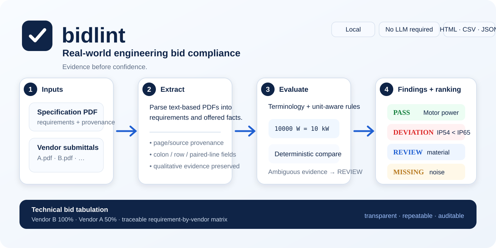

# bidlint

**Lint technical bids against specifications. Evidence before confidence.**



[](https://github.com/yigitcan-ozturk/bidlint/actions/workflows/tests.yml)
[](https://github.com/yigitcan-ozturk/bidlint/releases)
[](https://www.python.org/)
[](LICENSE)

`bidlint` is an open-source technical bid compliance engine for comparing engineering specifications with vendor datasheets, bids, submittals, explicit XLSX offer tables and explicitly scoped IFC property inputs.

It turns document evidence into explicit `PASS / DEVIATION / MISSING / REVIEW` findings, keeps source provenance, performs deterministic engineering comparisons where possible, and refuses to fabricate certainty where it cannot.

> Latest stable release: **v0.6.0**
>
> `v0.6.0` adds explicit formula-free XLSX vendor inputs while preserving the deterministic evaluator and provenance model.

```text
Specification PDF ──> requirements ──┐
                                     ├──> terminology + unit-aware rules ──> findings
Vendor PDF / XLSX / IFC ─> facts ────┘                              │
                                                                    ├──> JSON / CSV / Markdown / HTML / XLSX
Multiple vendors ────────────────────────────────────────────────────└──> technical bid tabulation
```

## The problem

Technical bid evaluation is still often performed by reading specifications and vendor submittals side-by-side, copying values into spreadsheets, and manually tracking deviations.

`bidlint` focuses on one narrow question:

> **What did the specification require, what did the vendor offer, and where is the evidence?**

The deterministic core does not need an LLM or an external API.

## 30-second demo

```bash
bidlint compare samples/pump-specification.pdf samples/vendor-a-submittal.pdf
```

```text
BIDLINT — TECHNICAL COMPLIANCE
================================
Score      : 50.0%
PASS       : 2
DEVIATION  : 1
MISSING    : 1
REVIEW     : 1

PASS       R0001  motor efficiency — Offered 93% satisfies >= 90%.
PASS       R0002  noise level — Offered 68db satisfies <= 70db.
DEVIATION  R0003  ip rating — Offered 54 does not satisfy >= 65.
REVIEW     R0004  housing — qualitative comparison requires review.
MISSING    R0005  flow rate — no sufficiently similar vendor parameter found.
```

For a reproducible walkthrough, see the [`five-minute demo`](docs/QUICKSTART.md).

## Multi-vendor technical bid tabulation

Compare several vendors against the same specification:

```bash
bidlint rank samples/pump-specification.pdf \
  samples/vendor-a-submittal.pdf \
  samples/vendor-b-submittal.pdf
```

```text
BIDLINT — VENDOR RANKING
================================
 1. vendor-b-submittal.pdf         100.0%  PASS 4  DEV 0  MISS 0  REVIEW 1
 2. vendor-a-submittal.pdf          50.0%  PASS 2  DEV 1  MISS 1  REVIEW 1
```

Generate a self-contained HTML comparison with a ranking summary and requirement-by-vendor matrix:

```bash
bidlint rank specification.pdf vendor-a.pdf vendor-b.pdf \
  --output technical-tabulation.html
```

Export the same review matrix as Markdown:

```bash
bidlint rank specification.pdf vendor-a.pdf vendor-b.pdf \
  --output technical-tabulation.md
```

Export a long-form audit CSV:

```bash
bidlint rank specification.pdf vendor-a.pdf vendor-b.pdf \
  --output technical-tabulation.csv
```

Or create a formula-free Excel workbook with `Ranking`, `Matrix` and `Audit` sheets:

```bash
bidlint rank specification.pdf vendor-a.pdf vendor-b.pdf \
  --output technical-tabulation.xlsx
```

For large vendor sets, `--top N` limits terminal display without truncating exported data.

See [`docs/BATCH_COMPARISON.md`](docs/BATCH_COMPARISON.md) and [`docs/WORKBOOK_EXPORT.md`](docs/WORKBOOK_EXPORT.md).

## Engineering-safe comparison

### Unit conversion

Known units in the same physical dimension are converted deterministically.

```text
Specification: Motor power shall be minimum 10 kW.
Vendor       : Motor power: 10000 W

PASS — Offered 10000w (= 10kw) satisfies >= 10kw.
```

Deterministic families include real power, voltage, current, frequency, apparent power, pressure, length, mass, force, flow and explicit temperature units. Missing, unknown or dimensionally incompatible units remain `REVIEW`.

See [`docs/ENGINEERING_UNITS.md`](docs/ENGINEERING_UNITS.md).

### Vendor datasheet layouts

Vendor facts can be extracted from several explicit layouts:

```text
Motor power: 11 kW
```

```text
Motor power        11 kW
Design pressure    10 bar
```

```text
Motor power
11000 W
```

```text
Housing material:
316L stainless steel
```

Layout-preserved tables with explicit headers, coordinate-aligned sparse rows, safe explicit rectangle geometry for merged intermediate cells, repeated explicit side-by-side header groups, compact side-by-side numeric fields, final offered values wrapped to the next numeric line, and explicitly hyphenated parameter continuations are supported conservatively.

Descriptive material grades such as `316L stainless steel` stay qualitative; they are not silently converted into a numeric value of `316`.

See [`docs/VENDOR_PARSING.md`](docs/VENDOR_PARSING.md).

### XLSX vendor inputs

`v0.6.0` can read an explicit formula-free XLSX offer table directly into the existing `VendorFact` model without adding a spreadsheet runtime dependency:

```bash
bidlint compare specification.pdf supplier-offer.xlsx
```

A worksheet must expose one parameter column and one offered-value column, with optional unit and section columns. When more than one visible worksheet exists, the caller selects one explicitly:

```bash
bidlint compare specification.pdf supplier-offer.xlsx \
  --xlsx-sheet "Technical Offer"
```

Spreadsheet evidence preserves the workbook filename, row number and selected worksheet/section. Formulas, macros, external relationships, hidden evidence sheets, merged cells and ambiguous header layouts are rejected rather than calculated or guessed.

See [`docs/XLSX_VENDOR_INPUT.md`](docs/XLSX_VENDOR_INPUT.md).

### IFC vendor inputs

`v0.5.0` can read explicitly scoped IFC property sets as vendor evidence through optional IfcOpenShell support:

```bash
pip install -e '.[ifc]'

bidlint compare specification.pdf equipment.ifc \
  --ifc-guid 1AbCdEfGhIjKlMnOpQrStu
```

You can also scope by IFC class when exactly one matching element exists, and optionally restrict extraction to one property set:

```bash
bidlint extract equipment.ifc --kind vendor \
  --ifc-class IfcPump \
  --ifc-pset Pset_PumpCommon
```

IFC property names such as `MotorPower` are normalized into ordinary vendor parameters such as `motor power` and then pass through the same deterministic matcher and evaluator used for PDF facts.

Ambiguous class selections are rejected rather than merging multiple IFC elements. Scalar numeric IFC properties remain unitless unless their source value explicitly contains a unit string.

See [`docs/IFC.md`](docs/IFC.md).

### Optional structured extraction

`v0.3.0` added a provider-neutral `StructuredExtractor` boundary for optional AI-assisted or external extraction. The base package still has no AI SDK, API-key or network dependency.

Provider candidates must carry confidence and page-local evidence. `bidlint` verifies that the declared page exists and that the evidence snippet actually occurs on that page before converting the candidate into a core `Requirement` or `VendorFact`.

Provider confidence is **extraction confidence only**. Providers cannot emit `PASS`, `DEVIATION`, `MISSING` or `REVIEW`; the existing deterministic matcher, unit converter and evaluator remain authoritative.

See [`docs/AI_EXTRACTION.md`](docs/AI_EXTRACTION.md).

### Local MCP server

`v0.4.0` exposes the same deterministic core through an optional local MCP server. The MCP dependency is separate from the base installation:

```bash
pip install -e '.[mcp]'
export BIDLINT_MCP_ROOT=/path/to/project/documents
bidlint-mcp
```

The server uses stdio and exposes synchronous `extract`, `compare` and `explain` tools. Large document work can use pollable local jobs through `submit_extract`, `submit_compare`, `job_status`, `job_result` and `cancel_job`.

All document and alias paths stay inside `BIDLINT_MCP_ROOT`; parent traversal and symlink escapes are rejected. Job records and terminal results are persisted under `.bidlint/jobs`, while interrupted queued/running jobs are explicitly failed after a server restart instead of silently resumed.

MCP clients still do not decide compliance. Both synchronous tools and queued jobs execute the same deterministic parsers, terminology matcher, unit conversion and evaluator used by the CLI.

See [`docs/MCP.md`](docs/MCP.md).

### supplier-scorecard technical hand-off

`v0.5.0` adds a versioned JSON hand-off for the companion `supplier-scorecard` project:

```bash
bidlint compare specification.pdf vendor-a.pdf \
  --supplier-name "Supplier A" \
  --scorecard-output supplier-a-technical.json
```

A numeric 0–100 `technical_compliance` signal is emitted only when no finding remains `REVIEW`. If review is still required, the integration output carries `technical_compliance: null` and an explicit `REVIEW_REQUIRED` status so unresolved engineering evidence does not silently influence procurement ranking.

See [`docs/SUPPLIER_SCORECARD.md`](docs/SUPPLIER_SCORECARD.md).

### Engineering terminology

Built-in terminology aliases normalize a deliberately small set of low-risk nomenclature variants:

```text
ingress protection rating -> ip rating
flow-rate                 -> flow rate
rotation speed            -> rotational speed
rated motor power         -> motor power
```

Project- or vendor-specific terminology can be declared explicitly:

```json
{
  "rated output": "motor power",
  "supplier ip code": "ip rating"
}
```

```bash
bidlint compare specification.pdf vendor.pdf --aliases aliases.json
```

Ambiguous concepts are intentionally not collapsed automatically. For example, `protection class` is not assumed to mean `ip rating`.

See [`docs/TERMINOLOGY.md`](docs/TERMINOLOGY.md).

## Status model

| Status | Meaning |
| --- | --- |
| `PASS` | Offered value deterministically satisfies the requirement |
| `DEVIATION` | Offered value deterministically violates the requirement |
| `MISSING` | No sufficiently similar vendor parameter was found |
| `REVIEW` | Evidence exists, but the comparison is qualitative, ambiguous or not safely deterministic |

`REVIEW` is a feature, not a fallback. The engine prefers explicit uncertainty over a false compliance decision.

## Outputs

### Single vendor

```bash
bidlint compare specification.pdf vendor.pdf --output compliance.json
bidlint compare specification.pdf vendor.pdf --output compliance.csv
bidlint compare specification.pdf vendor.pdf --output compliance.md
bidlint compare specification.pdf vendor.pdf --output compliance.html
```

### Multiple vendors

```bash
bidlint rank specification.pdf vendor-a.pdf vendor-b.pdf --output ranking.json
bidlint rank specification.pdf vendor-a.pdf vendor-b.pdf --output ranking.csv
bidlint rank specification.pdf vendor-a.pdf vendor-b.pdf --output ranking.md
bidlint rank specification.pdf vendor-a.pdf vendor-b.pdf --output ranking.html
bidlint rank specification.pdf vendor-a.pdf vendor-b.pdf --output ranking.xlsx
```

JSON is the machine-readable integration contract. CSV is optimized for tabular workflows. Markdown is convenient for code/design review. HTML is self-contained for browser review. XLSX provides a spreadsheet-native ranking, matrix and long-form audit without formulas or macros.

## Quick start

Requirements:

- Python 3.11+
- text-based PDFs for PDF extraction
- optional IfcOpenShell only when IFC vendor inputs are required
- no spreadsheet runtime dependency is required for XLSX vendor input or XLSX output

Install from source:

```bash
git clone https://github.com/yigitcan-ozturk/bidlint.git
cd bidlint
python -m venv .venv
source .venv/bin/activate
pip install -e .
```

Windows PowerShell:

```powershell
.venv\Scripts\Activate.ps1
```

Inspect extraction before comparing:

```bash
bidlint extract specification.pdf --kind specification
bidlint extract vendor.pdf --kind vendor
bidlint extract vendor.xlsx --kind vendor --xlsx-sheet "Technical Offer"
```

## Design principles

**Evidence before confidence.** Every result should remain traceable to its source document, selected XLSX row or selected IFC element.

**Deterministic where possible.** Numeric limits, unit conversions and explicit terminology mappings belong in code, not model opinion.

**Explicit uncertainty.** Unsupported or ambiguous comparisons remain `REVIEW`.

**Provider-independent core.** Optional AI-assisted extraction, MCP and ecosystem adapters are boundaries around the deterministic model, not authorities that decide compliance.

**Engineering first.** The project is designed around specification/submittal workflows rather than generic document chat.

## Architecture

```text
Specification PDF ──> requirement parser ─────────────────────┐
                                                              │
Vendor PDF ────────> vendor parser ────────────────────────────┤
Vendor XLSX ───────> explicit OOXML table adapter ─> VendorFact┤
IFC element ───────> property adapter ──> VendorFact ──────────┤
optional provider ─> evidence validator ───────────────────────┤
                                                              ▼
                                                   terminology matcher
                                                              │
                                                              ▼
                                                    unit-aware evaluator
                                                              │
                           ┌──────────────────────────────────┼──────────────────────────────┐
                           ▼                                  ▼                              ▼
                      single report                     vendor ranking              ecosystem exports
                           ▲                                  │                       JSON / XLSX /
                           │                                  ▼                       supplier-scorecard
                  MCP tools / local jobs                 audit exports
```

Detailed references:

- [`Architecture`](docs/ARCHITECTURE.md)
- [`Decision model`](docs/DECISION_MODEL.md)
- [`Data contract`](docs/DATA_CONTRACT.md)
- [`Engineering units`](docs/ENGINEERING_UNITS.md)
- [`Vendor parsing`](docs/VENDOR_PARSING.md)
- [`XLSX vendor inputs`](docs/XLSX_VENDOR_INPUT.md)
- [`IFC inputs`](docs/IFC.md)
- [`Optional structured extraction`](docs/AI_EXTRACTION.md)
- [`MCP server`](docs/MCP.md)
- [`supplier-scorecard contract`](docs/SUPPLIER_SCORECARD.md)
- [`Terminology`](docs/TERMINOLOGY.md)
- [`Batch comparison`](docs/BATCH_COMPARISON.md)
- [`Workbook export`](docs/WORKBOOK_EXPORT.md)

## Current limits

The limits are explicit by design:

- scanned/image-only PDFs require OCR before processing
- merged PDF cells without explicit supported rectangle geometry are not reconstructed
- arbitrary line-grid tables and ambiguous multi-column layouts without explicit repeated headers may need preprocessing
- only documented engineering unit families are converted automatically
- qualitative requirements remain `REVIEW` without an explicit deterministic rule
- terminology aliases are conservative unless the user provides a project-specific mapping
- no optional AI/model provider implementation is bundled in the core package
- provider evidence validation proves page-local text presence, not semantic correctness
- XLSX vendor input requires explicit parameter/offered headers and does not evaluate formulas or reconstruct merged cells
- multiple visible XLSX worksheets require explicit `--xlsx-sheet` selection
- IFC input is property-based only; geometry is not evaluated
- IFC class selection must resolve to one element or callers must provide `--ifc-guid`
- MCP is optional and local/stdin-stdout rather than a remote service
- running document jobs are cooperatively cancelled, not force-terminated
- in-progress local jobs are not resumed after a process restart
- XLSX output is a presentation/audit export and does not contain hidden compliance formulas

## Roadmap

See [`ROADMAP.md`](ROADMAP.md). `v0.6.0` is the latest stable release and adds explicit XLSX vendor input while preserving the same deterministic evaluator and provenance model.

Future work should be deliberately scoped rather than weakening the deterministic evidence-first boundary.

## Procurement / engineering tooling

`bidlint` is designed as the technical-compliance signal in a broader explainable procurement toolchain:

```text
currency-normalizer ──> rfqdiff ────────────────┐
                                                 │
payment-terms-parser ───────────────────────────┼──> supplier-scorecard
                                                 │
vendor-risk-engine ─────────────────────────────┤
                                                 │
bidlint ──> technical compliance ───────────────┘
```

## Development

```bash
pip install -e '.[dev]'
pytest -q
ruff check src tests
```

GitHub Actions targets Python 3.11, 3.12 and 3.13 and can also be started manually through `workflow_dispatch`.

## Security and confidential documents

Technical documents may contain confidential project, vendor or commercial information. The deterministic core runs locally and does not transmit documents to an external AI API. Optional provider integrations are responsible for their own data-handling and network policies.

XLSX vendor tables are read locally without formula evaluation or external-link traversal. The MCP server stays local by default and restricts file access to its configured root. IFC files are read locally through the optional adapter. See [`SECURITY.md`](SECURITY.md) before exposing document processing as a network service or connecting external extraction providers.

## Contributing

Contributions are welcome. See [`CONTRIBUTING.md`](CONTRIBUTING.md). High-value early contributions include sanitized real-world requirement patterns, unit cases, terminology edge cases and false-positive parsing examples.

## License

MIT. See [`LICENSE`](LICENSE).
